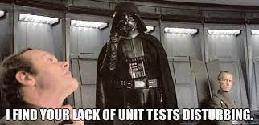

# Certifications

[Credly](https://www.credly.com/users/bijan-rahnamai) certification profile

{ align=left } 
 
 
 
 

## RHCSA

I got my [RHCSA](https://www.credly.com/badges/796add3d-d3f4-4111-bbf6-b5514a8b9005) back in 2019 for the Red Hat Enterprise Linux 7 exam.
This was one of the most challenging and fun certifications I have ever attempted, took me a few times to pass.
It is a hands-on exam that really expects an administrator to have hands on keyboard skills to perform needed maintenance and troubleshooting of Centos.
It was in this certification that I fell in love with Linux and have only been happier since.

## AWS Cloud Practitioner

This was my first [cloud certification](https://www.credly.com/badges/aba08615-3d8e-4175-b6cd-cd8d7be82691) in 2019, 
and it was a good intro into the Cloud Computing model, why it is important and a general survey of AWS services.

## RHCSAA

I got my [Ansible certification](https://www.credly.com/badges/c2e5eab7-e99e-4d9f-90a2-4b687bfd4d69) towards the end of 2019 for Ansible version 2.7.
This was definitely the most difficult (and fun!) certification I have ever had the pleasure of working on, also took me a few times to pass.
It exposed me to a DSL (domain specific language) that gave me the skills to write automation and reduce toil.
I used Ansible for the next few years to apply fixes at mass scale on servers to improve availability and quality in the hosting org of my company at the time.
After obtaining this cert I went to Atlanta for Ansiblefest, which was my first tech conference and learned so much.

## Hashi Terraform Associate

Hashicorp makes incredible products and my company uses their tools heavily. In 2020 I decided to get my 
[Terraform Certification](https://www.credly.com/badges/a31fc9c2-aa1b-4a4d-9d8b-563ff6ee0a31).
IaC (Infrastructure as Code) is one of the most important principles of Dev Ops that I have learned and practiced.
Using technology like this allows for immutable infrastructure, configuration as code, environments without config drift and automation at scale.

## Hashi Vault Associate

When you run distributed systems you are going to need a secure and reliable secrets store and that is what Vault provides.
At the end of 2020 I got my [Vault Certification](https://www.credly.com/badges/af5a6724-a774-4849-8484-dc8dd5b800e7) and was enlightened as to how flexible and robust the Vault tool is.
There are many secrets engines with Vault for many use cases, after taking this cert you definitely learn and understand how it can be used.

## Hashi Consul Associate

In 2021, I got the [Consul Certification](https://www.credly.com/badges/52032aa5-91b3-4f33-bfd3-3cc49e2d7fc2) and completed the 3 associate level certs that Hashi offered at the time.
My company uses Consul heavily for Service Discovery (and DNS) and it is a crucial piece to how we evaluate service health in our distributed clusters.
I can't recommend this technology enough as it is incredibly powerful and able to help manage the complicated pieces of having a service catalog.

## AWS Certified Solutions Architect

This is my latest certification that I have received this past year (2022). The [Solutions Architect cert](https://www.credly.com/badges/fec720eb-2bf0-4b8b-acc5-70eb8b1e8032) wasn't too challenging, 
but it was enlightening to see how expansive the AWS catalogue is as well as how sophisticated they build their products.