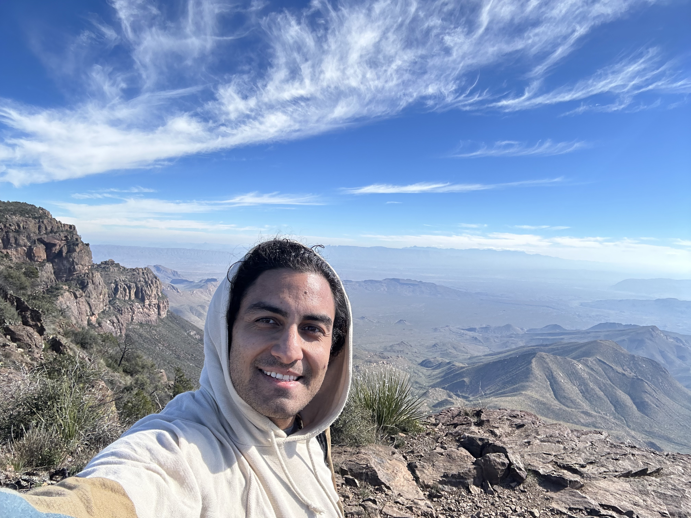
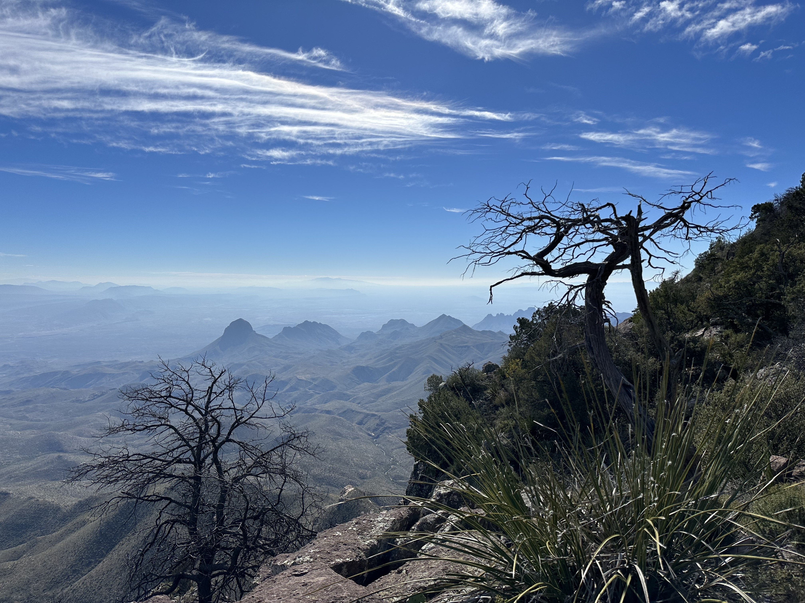

# Poetry | Artistry | Mastery

## Merry Christmas 2023

{ style="float": right }

### Love is all that is real

Love is all that is real 
it shows up in greetings cards and poetry open mics 
hugs, smiles and gathering with delicious food 
when asking how to improve 
use more love, it is what is true 
feeds our soul and heart 
the expressions in words, actions and art 
part with the ideas of representation 
to see the nothing underneath 
the sensations of Love complete, Love Supreme 
it is always here, now 
we are allowed this sublime infinite expanse 
this Love is an ecstatic dance 
it is what made the Sufi's whirl in trance 
history shows our poets with the same message 
embedded in different methods 
poured in different drinks 
Love changes how we think 
it grows our capacity to heal 
Love knows no expectations 
needs no confirmation 
Love is what we feel 
it is a miracle 
that Love is all that is real 

{ style="float": right }

### Christmas Day

Birthday wishes granted, Christmas packaging unwrapped 
with poetry tape handling how we keep this love on tap 
makeshift, make the shift into making new shifts with position 
the first lesson is always make moments to listen 
in between the stimulus and response there is this decision 
wholehearted Love and Soul living 
with your friends, family, mentors and children  
the way it happens by itself like intuition 
you don't have to push hard to see how things fall in 
places, people and things 
tall order of our best times together 
wishing to savor, the interconnectedness is never severed 
the energy and emptiness goes on forever 
it's all you've ever seen, and it is enough 
sometimes holidays are the tough stuff 
wherever ever you are at, it's the perfect time and place, to be looking up 
with grace and gratitude we offer blessings and tip our cup 

## About me

{ align=left }

Bijan is a local poet from Austin Texas who for years was an Artist of writing code and maintaining highly available systems. 
He has retired from corporate America engineering and is spending his time bringing Austin Poetry back to life. 
 
He studies under the tutelage of the greatest living American Poet, [Thom the World Poet](https://thomworldpoet.blogspot.com/), who is known to drop improvised verse at open mics of the city and has a compulsion to write and share poetry from the depths of love. 
 
When Bijan is not performing he is typically reading books, listening to vinyl records, crafting his artistry through different forms of expression and learning how to make a small business grow. 
Bijan has been influenced greatly by the lyricists of Hip Hop who were concerned with Mastery, with the timeless art of freestyle (making things up on the spot) and open mic culture. 
He manages the site [austinopenmicpoetry.com](https://www.austinopenmicpoetry.com). 

You can reach him via email at bijan@bijanrahnamai.com 
Instagram - [https://www.instagram.com/baustinpoetry/](https://www.instagram.com/baustinpoetry/) 
YouTube - [https://www.youtube.com/@baustinpoetry](https://www.youtube.com/@baustinpoetry/) 
