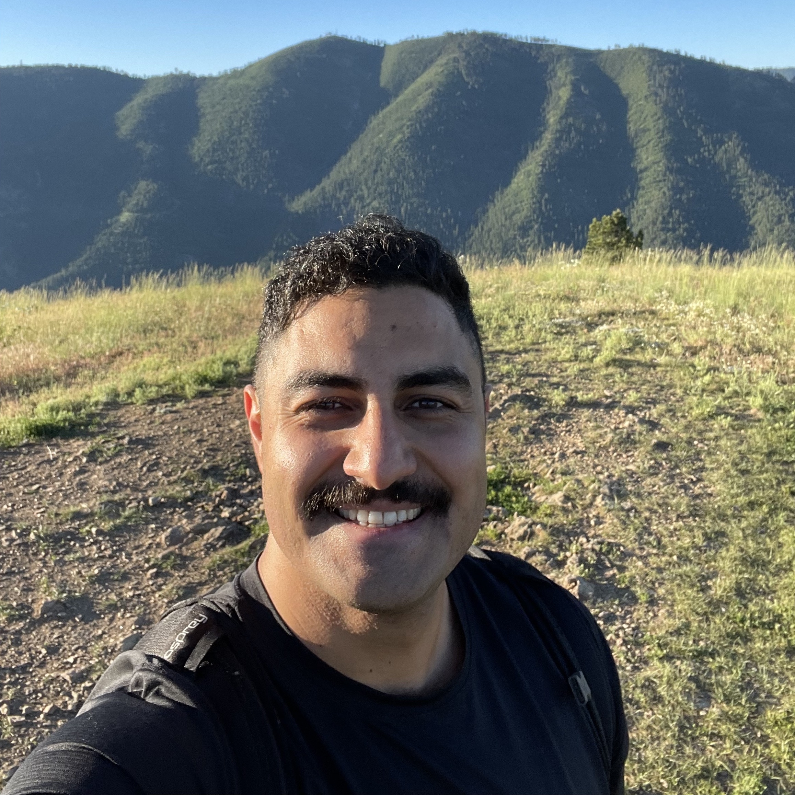

# Welcome Home

{ align=left } 
 
 
 
 
 
 
 
 
 
 
 
 
 
 
 
 

## Software Delivery

The thing that excites me most in my work is figuring out how to build and maintain better systems to delivery software updates. 

Below is a Quote from the DevOps Handbook from a Case Study Highlighting the importance of understanding the changes that we make. 
>In 2004, Gene Kim, Kevin Behr and George Spafford note that high-performing organizations recognize that 
> 80% of all outages are caused by change 
> and 80% of MTTR is spent trying to determine what changed. 

## 1. Automation at Scale
Automation at Scale means when we know a fix is available, we are primarily focused on delivering that fix to All Customers and Environments. 
Applying a specific minor update to an individual customer in an Adhoc way is also valuable, and there is a place for transformational Self Service however the Ultimate focus for every organization is Automation at Scale. 
Embracing Automation means that we will seek to eliminate as much Toil (manual work that is repeatable) to focus energy more closely on automation.

## 2. Standardization across Applications
Standardization whether in the form of Naming Conventions, configuration, workflows, technologies or frameworks is important. 
Requiring standards like only allowing certain naming conventions in Production services or even lower environments  means you won't have automation break and there won't be special snowflakes to handle manually via toil. 
Without consolidation of frameworks you end up supporting 3 different types of drivers, OS's, or frameworks. 
Applying a very rigid standard across all elements of customers allows anomaly detection and the ability to understand immediately if a service belongs or not. 
Most companies pay for services to be running because they don't know if they can turn it off or if they know they can turn it off they just don't know how to because of technical debt. 
Standardization across Applications allows for Automation at Scale. 

## 3. Continuous Feedback Loop
In the DevOps Handbook The Second Way describes the principles of creating fast and continuous feedback loops from Operations to Development. 
By doing this, we shorten and amplify feedback loops so that we can see problems as they occur and radiate this information to everyone in the value stream. 
This allows us to quickly find and fix problems earlier in the software development life cycle, ideally long before they cause a catastrophic failure. 

## 4. Error Budgets
Not all services are equally performant, some have a much older code base which is more large and complicated while others might be more green field and have fewer dependencies. 
Services should be evaluated based on the number of issues that occur throughout the lifecycle of their release, customer impact (outages/degradation of service) is one of the most valuable measures to determining impact. 
By better understanding the risk and challenges with each service delivered (and by breaking down Monolithic apps into Microservices) we can provide better Gating as to which services will be released and which ones will require more work. 
Error budgets are also a great way determine if Engineering should have a clear runway for new features or if code quality requires more robust testing. 

## 5. Test in a Lower Environment First
This one almost seems too obvious to be in the list, however one might be surprised how many Production services get deployed and run for customers without a lower environment first. 
Always include lower environment testing and deployment prior to delivering (or even troubleshooting) in Production first. 

## 6. Errors should be captured and improved
Every error is important. Often in software engineering a benign error will go overlooked and continuously be logged or returning a non 200 HTTP response. 
Even if the error is "Known" or could be classified as non-impactful (red herring in troubleshooting), that error still takes up space in the minds of engineers, in the logs/metrics/traces and ultimately makes an application less observable. 

## 7. Break up deployments to enable faster delivery
By breaking up deployments into small batches to deliver updates more quickly and regularly we can reduce risk of big issues showing up across multitudes of customers, correcting issues as they are found in the wild. 
Feature Flags are a valuable way to deliver more modular updates of components in which we can deliver deliberate updates of increasing surface area to customers as we gain confidence in the updates before the entirety is delivered. 

## 8. Data Driven Decision making
Embracing telemetry to build Observability into our updates help us understand the changes we are introducing into Production. 
We can test the code that is being cut by Development pre and post update for Quality and provide that data upstream. 
We can also test our deployment pipeline to determine if any environmental issues or deployment issues happen pre and post update on the side of Operations. 

## 9. Decommission apps, environments and frameworks
Letting applications, frameworks and environments run when they are not needed is incredibly expensive. 
It is much easier to deploy new services than to know when and how we can turn off old services, or to understand if they are still needed. 
By creating a central software delivery and deployment mechanism we can more assuredly understand what applications may be running but could be flagged for decommisioning. 

## 10. Continuous Delivery to Continuous Deployment
Making use of all the tools and experiences to mitigate risk, monitor quality and improve software delivery speed we eventually get to the place of Continuous Deployment. 
Continuous Deployment is where each change committed to version control is integrated, tested and deployed into production. 
Jez Humble defines Continuous Deployment as the following.

> When all developers are working in small batches on trunk, or everyone is working off trunk in short-lived feature branches that get merged to trunk regularly, and when trunk is always kept in a releasable state, and when we can release on demand at the push of a button during normal business hours, we are doing continuous delivery.
> Developers get fast feedback when they introduce any regression errors, which include defects, performance issues, security issues, usability issues, etc.
> When these issues are found, they are fixed immediately so that trunk is always deployable.
 
> In addition to the above, when we are deploying good builds into production on a regular basis through self-service (being deployed by Dev or by Ops)—which typically means that we are deploying to production at least once per day per developer, or perhaps even automatically deploying every change a developer commits—this is when we are engaging in continuous deployment.
 

### Skydiving

{ align=left }

Jumping out of planes might seem insane 
the feelings of fear change and re-arrange 
perspective is my favorite part of the brain 
teaching ourselves to be even more highly trained 

{ align=left }

My excitement is one of my favorite qualities 
Equanimity, Stoicism and a capricious wisdom 
Engineering paths to freedom and graphs of the larger lump sum 
my favorite ones are most simple in principle 

{ align=left }

It took time to learn to stand tall 
even more time to embrace the fall 
visualizing the drop while taking cold showers a lot 
now cold showers are how I cool off in the Texas hot 

{ align=left }

Heather is my favorite person 
My rock when I need solid advice 
My love and delight 
The best version of everything I like 

{ align=left }

Went for a run to Barton Springs 
saw James on his 60th with family relaxing 
in a few hours got together with Heather 
and all three of us jumped out the flying bus 

{ align=left }

With Love you have to trust 
There will always be a way 
give more than you take away 
for it is the way 

## About me

{ align=left }

Howdy! You found me on the internet :), this is my personal website to share with the rest of the digital world.
I am a first generation Persian (Iranian) American who grew up in Austin, Texas.
My day job is working in Fintech as a Senior Site Reliability Engineer at Q2. I am a big fan of the following. 

* Hiking up Mountains
* Spending time with my gf and our Fluffy Rotti named Nacho (pictures coming soon, stay tuned)
* Meditation/Sauna/Cold Plunges/Yoga/Lifting Weights/Running/Float Tanks
* Learning in public
* Poetry, Rapping, Freestyling

I am looking forward to more updates to come.
 
You can reach me via email here at bijan@bijanrahnamai.com 
You can find my Github here at [https://github.com/BijanJohn](https://github.com/BijanJohn) 
You can find my LinkedIn here at [https://www.linkedin.com/in/bijan-rahnamai-a581b28a/](https://github.com/BijanJohn) 
You can find my Instagram here [https://www.instagram.com/bee_szan/](https://github.com/BijanJohn) 