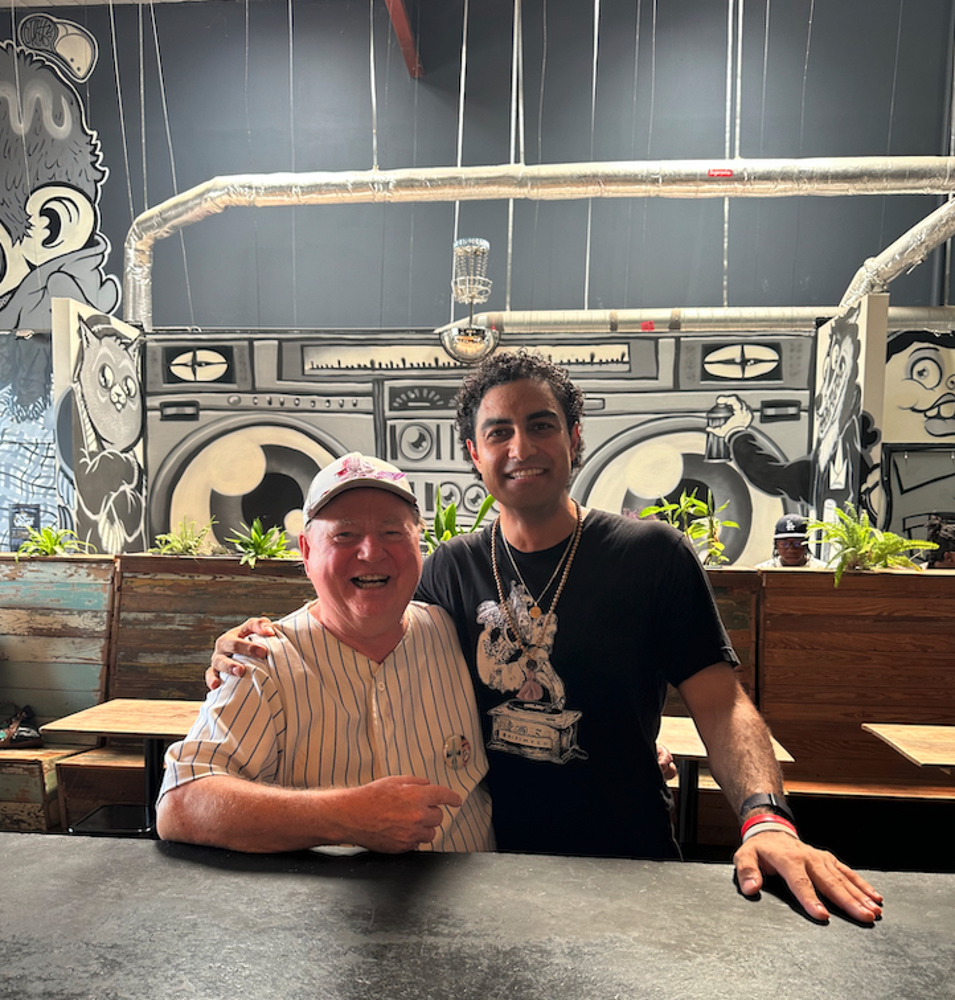

# Rapping | Software | Knowledge

## About me

{ align=left }

Howdy! You found me on the internet :), this is my personal website to share with the rest of the digital world.
I am a first generation Persian (Iranian) American who grew up in Austin, Texas.
I have spent the last 10 years working in software engineering and now am on my 2nd career becoming a Hip Hop Artist.
I am a big fan of the following. 

* Hiking up Mountains
* Meditation/Sauna/Cold Plunges/Yoga/Lifting Weights/Running/Float Tanks
* Learning in public
* Poetry, Rapping, Freestyling

I am looking forward to more updates to come.
 
You can reach me via email here at bijan@bijanrahnamai.com 
You can find my GitHub here at [https://github.com/BijanJohn](https://github.com/BijanJohn) 
You can find my LinkedIn here at [https://www.linkedin.com/in/bijan-rahnamai/](https://www.linkedin.com/in/bijan-rahnamai/) 
You can find my Instagram here [https://www.instagram.com/bijanraps/](https://www.instagram.com/bijanraps/) 

The guy in the picture with me is [Thom the World Poet](http://thomworldpoet.blogspot.com/), and he is the great living American Poet, he too lives in Austin.  