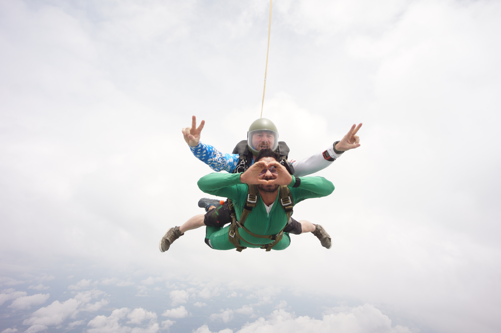
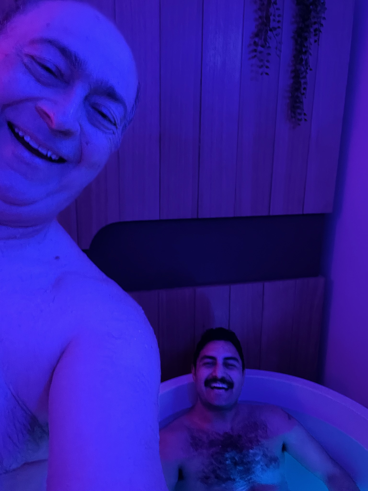

# Welcome (to my) Home

### Skydiving

{ align=left }

Jumping out of planes might seem insane 
the feelings of fear change and re-arrange 
perspective is my favorite part of the brain 
teaching ourselves to be even more highly trained 

{ align=left }

My excitement is one of my favorite qualities 
Equanimity, Stoicism and a capricious wisdom 
Engineering paths to freedom and graphs of the larger lump sum 
my favorite ones are most simple in principle 

{ align=left }

It took time to learn to stand tall 
even more time to embrace the fall 
visualizing the drop while taking cold showers a lot 
now cold showers are how I cool off in the Texas hot 

{ align=left }

Heather is my favorite person 
My rock when I need solid advice 
My love and delight 
The best version of everything I like 

{ align=left }

Went for a run to Barton Springs 
saw James on his 60th with family relaxing 
in a few hours got together with Heather 
and all three of us jumped out the flying bus 

{ align=left }

With Love you have to trust 
There will always be a way 
give more than you take away 
for it is the way 

## About me

{ align=left }

Howdy! You found me on the internet :), this is my personal website to share with the rest of the digital world.
I am a first generation Persian (Iranian) American who grew up in Austin, Texas.
My day job is working in Fintech as a Senior Site Reliability Engineer at Q2. I am a big fan of the following. 

* Hiking up Mountains
* Spending time with my gf and our Fluffy Rotti named Nacho (pictures coming soon, stay tuned)
* Meditation/Sauna/Cold Plunges/Yoga/Lifting Weights/Running/Float Tanks
* Learning in public
* Poetry, Rapping, Freestyling

I am looking forward to more updates to come.
 
You can reach me via email here at [bijan@bijanrahnamai.com](bijan@bijanrahnamai.com) 
You can find my Github here at [https://github.com/BijanJohn](https://github.com/BijanJohn) 
You can find my LinkedIn here at [https://www.linkedin.com/in/bijan-rahnamai-a581b28a/](https://github.com/BijanJohn) 
You can find my Instagram here [https://www.instagram.com/bee_szan/](https://github.com/BijanJohn) 